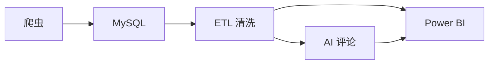

# 成都租房数据分析

作者: JYQ
日期: 2026-06-10

## 项目背景与目标
本项目面向成都租赁市场建设爬虫数据管道，目标是:
- 自动采集成都主城区租房原始房源数据
- 将数据落入 MySQL 进行规范化存储
- 通过 ETL 清洗、提取关键指标
- 结合 AI 生成区域租房点评
- 支持 Power BI 可视化分析与报表刷新

项目旨在提升租房数据透明度，为房东、租客和分析师提供成都租金、户型、面积和商圈对比洞察。

## 技术架构图

## 环境要求
- Python 3.10
- MySQL 8.0
- Power BI Desktop
- 支持 Playwright 浏览器自动化的 Chrome/Chromium

## 快速运行步骤
1. 安装依赖
   - `pip install -r requirements.txt`
2. 运行爬虫
   - `python crawler/spider.py`
3. 执行 ETL 清洗
   - `etl/run_etl.bat`
   - 或 `python etl/clean_data.py`
4. 生成 AI 点评
   - `python ai_scripts/generate_district_comments.py`
5. 刷新 Power BI
   - 打开 `powerbi/` 中的报表文件（如存在）
   - 使用 Power BI Desktop 刷新数据源

## 配置文件说明
- `config/config.yaml`
  - MySQL 数据库连接信息
  - 爬虫请求间隔、重试、超时和行政区列表
- `config/etl_config.yaml`
  - ETL 清洗规则，包括价格区间、面积区间和异常值检测策略
- `config/ai_config.yaml`
  - AI 生成配置，包括 llm provider、api_key、模型、temperature 和提示模板

## 数据量统计
- 原始数据来源: MySQL 表 `raw_rent`
- 清洗后数据: MySQL 表 `clean_rent`
- 当前示例运行日志显示:
  - 新增待清洗原始记录: 10 条
  - 本次清洗后有效干净记录: 0 条
- 包含行政区: 锦江区、青羊区、金牛区、成华区、武侯区、高新区（至少 6 个）

> 注: 实际数据量请以当前 MySQL 数据库中 `raw_rent` 和 `clean_rent` 表为准。

## 已知问题与改进方向
- 反爬策略
  - 当前爬虫仍需手动应对验证码或页面检测
  - 未来可增加代理池、UA 轮换、动态浏览器指纹
- 数据量不足
  - 当前仅覆盖少量区域与页面，建议增加页面抓取深度和行政区范围
- 清洗规则
  - 价格/面积阈值可进一步依据历史数据自动调整
  - 异常值检测可加入更多字段（如户型、商圈、楼层）
- Power BI
  - 可补充报表模板与数据模型说明
  - 建议增加仪表板、时间趋势和区域对比分析
